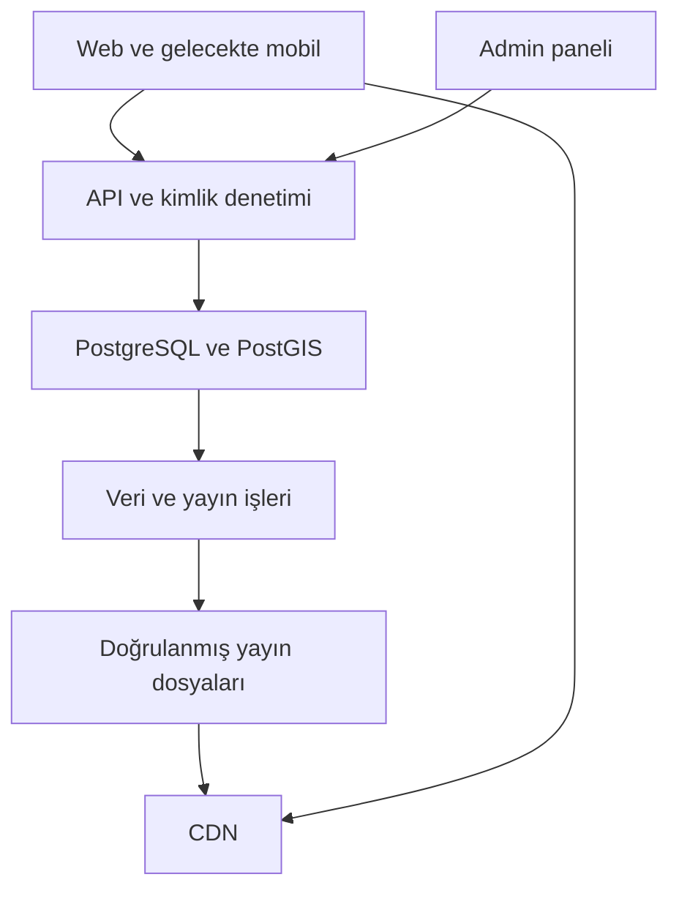

# Dünya Medeniyet Atlası — üst seviye plan

Sürüm 0.1 · 12 Eylül 2026 · Durum: uygulanabilir tasarım, üretim sistemi değil.

## 1. Ürün hedefi

Kullanıcı bir tarih seçer, o tarihte dünyanın farklı bölgelerinde hangi devletlerin, medeniyetlerin ve toplulukların bulunduğunu görür; bir bölgeye dokunarak tarihini ve dayanaklarını inceler. Ayrı bir görünüm, belirli bir toplumun veya harita yapımcısının dünyayı nasıl bildiğini/gösterdiğini sunar.

Ürünün değeri üç parçanın birlikte çalışmasıdır: akıcı harita, doğru tarih bağlamı, incelenebilir kaynak. Gösterişli fakat kanıtsız sınırlar bu hedefi karşılamaz.

## 2. İki görünümün sınırı

| Görünüm | Ne gösterir? | Zorunlu bağlam |
|---|---|---|
| Tarihsel dünya | Bugünkü coğrafi referans üzerinde, tarihsel kanıtlara göre o tarihteki siyasi yapılar, kültür alanları ve yerleşimler | Seçilen tarih, kapsama durumu, belirsizlik ve veri sürümü |
| Dönemin bilinen dünyası | Kaynağı bulunan bir toplumun, coğrafyacının veya harita geleneğinin dünya tasavvuru | Bakış açısı, tasavvurun tarihi, eldeki eserin/kopyanın tarihi, kaynak ve yeniden kurma yöntemi |

“Bilinen dünya” bütün insanlığın ortak bilgisi değildir. Kaynakta gösterilmeyen yer “orada insan yoktu” veya “kimse bilmiyordu” şeklinde yorumlanmaz. Bakış açısı kaynakta tanımlanamıyorsa bu açıkça yazılır.

Bu ikinci görünüm kullanıcı tarafından seçildi ve ürün kapsamına dahildir. Ancak her tarih için arşiv haritası varmış gibi içerik üretilmez. Veri yoksa ilgili görünüm açıklamalı boş durum gösterir.

## 3. Tarihsel doğruluğun ürün kuralları

1. MÖ 4000 arayüzün başlangıcıdır; bütün medeniyetlerin başlangıcı olduğu iddia edilmez.
2. Devlet, medeniyet, arkeolojik kültür, yerleşim ve etki alanı farklı varlık türleridir.
3. Siyasi kontrol, egemenlik iddiası ve kültürel yayılım farklı katmanlardır; aynı yerde örtüşebilir.
4. Antik kültür bölgeleri çağdaş devletler gibi keskin, dolu ülke poligonlarına zorlanmaz.
5. Kaynak yoksa modern ülke sınırlarından tarihsel sınır türetilmez; AI ile poligon uydurulmaz.
6. Her harita geometrisinin ve her önemli bilgi iddiasının kendi dayanağı vardır. Genel bir kaynakça tek başına yeterli değildir.
7. Kaynak metni, tarih aralığı, sayfa/harita numarası, lisans, erişim tarihi, editör ve inceleyen kaydedilir.
8. “İncelenmiş”, doğruluğun mutlak garantisi değildir. Yaklaşık, tartışmalı ve eksik bilgilerin gerekçeleri gösterilir.
9. Dünya zemini ilk sürümde günümüz coğrafi referansıdır. Tarihsel kıyı çizgisi/nehir yatağı doğruluğu iddia edilmez; açıklama haritada ulaşılabilir olur.
10. Günümüz için de veri tarihi gösterilir. Arayüzün bugüne ulaşması, verinin bugün güncellendiği anlamına gelmez.

## 4. Kullanıcı ve admin kapsamı

| Rol | Temel iş |
|---|---|
| Misafir | Hesap açmadan haritada gezinme, tarih seçme, kaynaklı bilgi okuma |
| Üye | Favori tarih/bölge kaydetme, kaldığı görünüme dönme, düzeltme önerme |
| Editör | Varlık, adlandırma, kaynak, iddia, geometri ve arşiv haritası taslağı hazırlama |
| İnceleyen | Tarihsel dayanak ve lisans kontrolü; değişikliği kabul veya reddetme |
| Admin | Kullanıcı erişimi, yayın sürümü, içe aktarma işleri, geri alma ve denetim kaydı |

Üye kayıtları doğrulanmış e-posta ile açılır. Rol yükseltme kullanıcının profil alanından yapılamaz. İlk admin tek seferlik kontrollü kurulumla atanır. Editör/admin için MFA zorunludur.

Kullanıcı analitiği başlangıçta ürünün gerektirdiği minimumla sınırlı tutulur: kayıt tarihi, durum, son giriş ve kullanıcıya ait favoriler. Her tıklamayı kişiye bağlayan izleme ilk sürüme dahil değildir.

## 5. İlk kullanılabilir sürüm

İlk sürüm dünya haritasını ve MÖ 4000–günümüz zaman eksenini destekler. İçerik kapsamı küçük, incelenmiş bir başlangıç koleksiyonu olarak yayınlanır; dünya tarihinin tamamlandığı söylenmez.

Planlama hedefi: 20–30 varlık, 40–80 kaynaklı iddia, 15–30 ayrı incelenmiş geometri revizyonu ve iki bakış açısı haritası. Bunlar mevcut veri sayıları değil, veri keşfi sonunda güncellenecek hedeflerdir. Kaynak bulunamazsa sayı uğruna geometri çizilmez.

Başlangıç koleksiyonu için önerilen deneme alanları: Mezopotamya ve Nil çevresi; Akdeniz'den bir sonraki dönem; Doğu/Güney Asya'dan bir örnek; Amerika kıtalarından bir örnek; Afrika'nın Akdeniz dışından bir örnek; modern dönemden bir örnek. Kesin varlıklar ve tarihler kaynak denemesi sonucunda seçilir.

İlk kullanılabilir sürümün tamamlanma koşulları:

- Tarih seçme → haritada isim görme → bölge seçme → bilgiyi ve kaynağı açma akışı çalışır.
- İki görünüm arasında geçiş vardır; ikinci görünüm en az iki hakları incelenmiş örnek içerir.
- Kaynaklı içerik admin panelinden taslak, inceleme ve yayın aşamalarından geçer.
- Üye kaydı, giriş, çıkış, favoriler, hesap silme isteği ve yetki ayrımı çalışır.
- Yanlış yayın tüm içerik bileşenleriyle birlikte önceki sürüme alınabilir.
- Kapsama boşlukları kullanıcıya doğru anlatılır.

## 6. UX yaklaşımı

Ana sayfa doğrudan haritayla açılır. Üstte görünüm seçimi ve arama; altta tarih kontrolü; seçimde masaüstünde yan panel, telefonda kademeli açılan alt panel bulunur.

6000 yıllık küçük bir kaydırıcı tek kontrol olmaz: doğrudan yıl/MÖ–MS girişi, zaman eksenine yakınlaşma, dönem kısayolları ve önceki/sonraki belgelenmiş değişim birlikte kullanılır. Tarih yazarken eski harita yeni tarih etiketiyle gösterilmez.

Seçim detayında önce anlaşılır kısa özet, sonra “bu tarihte” bilgileri, olaylar ve kaynaklar gelir. Birden çok örtüşen kayıt varsa kullanıcı hangisini seçtiğini görür.

Renk aynı varlık için sürümler arasında kararlı kalır. Belirsizlik yalnız renkle anlatılmaz: desen, kesik çizgi ve açık etiket kullanılır. Hareket azaltma tercihi desteklenir.

## 7. Önerilen teknik yapı

| Katman | Öneri | Gerekçe |
|---|---|---|
| Web ve admin | Next.js + TypeScript, aynı uygulamada ayrı yetkili alan | Tek geliştirici için operasyon ve kod tekrarı az |
| Harita | MapLibre GL JS | Vektör harita, veri katmanları, seçim ve zaman filtresi desteği |
| API | Next.js içinde sürümlü REST, ayrı domain/servis katmanı | Mobil uygulama aynı sözleşmeyi kullanır |
| Veri | PostgreSQL + PostGIS | Zaman ve coğrafi alan sorgularını birlikte karşılar |
| Kimlik | Yönetilen kimlik servisi; ilk aday Supabase Auth | Parola/MFA protokolünü sıfırdan yazma yükünü azaltır |
| Dosya ve yayın | Yönetilen nesne depolama + CDN | Harita dosyaları, sürüm manifestleri ve izinli görseller |
| Veri işleri | Aynı repoda ayrı worker işi | İçe aktarma ve yayın işlemleri web isteği süresine bağlı olmaz |
| İzleme | Hata, iş kuyruğu, veri sürümü ve maliyet ölçümü | Hatalı içerik ile sistem hatasını ayırır |

MapLibre'ın resmi belgeleri vektör haritaları ve mobil karşılığını tanımlar; Supabase PostGIS desteği resmi belgede yer alır. Bunlar ürün tercihlerinin teknik dayanaklarıdır. [MapLibre](https://maplibre.org/maplibre-gl-js/docs/), [Supabase PostGIS](https://supabase.com/docs/guides/database/extensions/postgis).

Sağlayıcı hesabı, bölge, paket ve ücretli kaynak bu turda açılmaz. Barındırmada standart Node ortamı önerilir. Sürümler gerçek uygulama başlangıcında güncel uyumluluk/güvenlik durumuna göre sabitlenir; bu belgede tahmini paket sürümü yazılmadı.

CDN'e yalnız yayın kontrolünden geçen içerik çıkar. Üye özel verileri ve editoryal taslaklar bu akıştan ayrıdır.

## 8. Gereksiz karmaşıklığı önleme

- Bir repo, bir ana uygulama, bir ilişkisel veritabanı ve bir worker ile başlanır.
- Mikroservis, Kubernetes, GraphQL, vektör veritabanı ve ayrı arama kümesi başlangıçta gerekli değildir.
- Her yıl için dünyanın tam kopyası üretilmez. Belgelenmiş değişimler ve geçerlilik aralıkları tutulur.
- Önce sınırlandırılmış GeoJSON ile ölçüm yapılır. Veri boyutu/cihaz testleri gerektirirse vektör döşemelere geçilir.
- Harita üretme servisi ile tarihsel veri doğrulama birbirinden ayrılır; görsel çıktı kanıt sayılmaz.
- AI yalnız kaynaklı taslak/çeviri yardımında kullanılır. Kaynak uydurmasına ve insan incelemesi olmadan yayın yapmasına izin verilmez.
- Genel topluluk düzenlemesi, sosyal özellikler, abonelik ve ödeme, 3D savaş canlandırmaları ilk sürüme eklenmez.

## 9. Aşamalı teslim

| Aşama | Sonuç | Çıkış koşulu |
|---|---|---|
| A — Kaynak denemesi | İzinli, tarih ve geometri açısından uygun örnek koleksiyon | Kaynak zinciri ve lisans kabulü doğrulanır |
| B — Teknik dikey dilim | Tarih → harita → seçim → kaynak; sentetik QA verisi ayrı | Tarih matematiği, mobil akış ve performans ölçülür |
| C — İçerik ve hesap yönetimi | Admin iş akışı, üyelik, roller, yayın sürümleri | Yetki testleri, geri alma ve yedekten dönüş geçer |
| D — Kapalı beta | Küçük fakat gerçek ve incelenmiş koleksiyon | Kullanılabilirlik, doğruluk ve güvenlik kapıları geçer |
| E — Kapsam genişlemesi | Bölge/dönem paketleri, veri üretiminin ölçülmesi | Her paket aynı kaynak ve yayın koşullarını sağlar |
| F — Mobil uygulama | Aynı API, hesaplar ve koleksiyonlar üzerinde mobil istemci | Native harita ve oturum denemesi başarılıdır |

Web'de responsive kullanım baştan vardır. PWA sonraki küçük adım olabilir. Native uygulamada React Native/Expo ilk adaydır; MapLibre Native uyumluluğu, offline veri hakları ve cihaz performansı kısa bir denemeyle doğrulanmadan kesin seçim yapılmaz.

## 10. Süre ve bütçe planlaması

Kesin teslim tarihi için henüz yeterli veri yoktur. Görev bazlı başlangıç eforu [teslim planında](06-delivery-plan.md) hesaplanır. “Gün” 7 saatlik odaklı geliştirici günüdür; takvim günü değildir. Tarihçi incelemesi, veri lisansı bekleme süresi ve geniş ölçekli sayısallaştırma ayrıca planlanır.

Asıl değişken maliyet veri hazırlama ve tarihsel incelemedir. Önce bir geometriyi kaynaklandırıp incelemeye götürmenin gerçek süresi ölçülür; dünya kapsamı bu gözlemle tahmin edilir.

Altyapı maliyet modeli:

    aylık toplam = web barındırma + veri/kimlik + dosya/CDN + e-posta + izleme + yedek
    trafik GB ≈ aylık kullanıcı × kullanıcı başına oturum × oturum başına MB / 1000

Örnek kapasite varsayımı: 1.000 aktif kullanıcı × 4 oturum × 8 MB = 32 GB/ay; 10.000 kullanıcı için 320 GB/ay. Bu bir ölçüm veya sağlayıcı fiyat teklifi değildir. Gerçek harita boyutu beta ölçümünden alınır. Ücretli kurulum öncesi sağlayıcıların güncel fiyatlarıyla maliyet tablosu tamamlanır.

## 11. Başarı ve yayın kapıları

| Alan | Hedef |
|---|---|
| Temel kullanım | 5 deneme kullanıcısından en az 4'ü yardım almadan 30 saniyede tarih/bölge/kaynak akışını tamamlar |
| Erişilebilirlik | Tarih, görünüm, sonuç seçimi ve kaynaklar klavyeyle erişilir; haritasız sonuç listesi vardır |
| Performans | Tanımlanmış orta sınıf telefonda soğuk açılışta kullanılabilir harita ≤4 sn hedefi; ölçülmeden başarı iddia edilmez |
| Tarih değiştirme | Veri önbellekteyken p95 görünüm güncellemesi ≤200 ms hedefi |
| Ağ sorgusu | Belirlenmiş beta veri hacminde p95 ≤800 ms hedefi; payload üst sınırı uygulanır |
| Doğruluk | Yayınlanmış geometri/önemli iddiaların %100'ü kaynak ve inceleme kaydına bağlıdır |
| Güvenlik | Yetkisiz okuma/yazma ve taslak sızıntısı testlerinde sıfır bilinen kritik açık |
| İşletim | Önceki içerik sürümüne dönüş ve yedekten geri yükleme denemesi başarılıdır |

## 12. En önemli riskler

| Risk | Sonucu | Önlem |
|---|---|---|
| Eksiksiz tarihsel sınır verisinin doğrulanamaması | Kapsam ve takvim yanlış vaat edilir | Kaynak denemesi ilk kapı; eksikler görünür |
| Medeniyet ile devletin karıştırılması | Tarihsel yanıltma | Ayrı tür, katman ve açıklama |
| Harita arşivi lisansının belirsizliği | İçeriği kaldırma/yeniden üretme gereği | Kayıt bazında hak kontrolü ve yayın engeli |
| MÖ/MS yıl hatası | Bütün zaman sorguları yanlışlaşır | Ortak zaman çekirdeği ve sınır testleri |
| Taslak/özel verinin CDN'e çıkması | Kalıcı veri sızıntısı | Ayrı depolar, temiz yayın çıktısı, doğrudan erişim testleri |
| Sürüm geçişinde karışık veri | Harita ve açıklamalar uyuşmaz | Tüm yanıtlar aynı release_id ile okunur |
| Yanlış şema değişikliği | Kesinti veya veri kaybı | Eklemeli geçiş, staging, yedek ve geri dönüş planı |
| Çok büyük geometri | Telefonda donma ve beklenmedik trafik | Boyut sınırı, LOD, döşeme geçiş eşiği |

Bu plan tam dünya veri setinin hazır bulunduğunu veya uygulamanın tamamlandığını iddia etmez. Bir sonraki somut geliştirme adımı kaynak denemesine bağlı çalışan dikey dilimdir.
